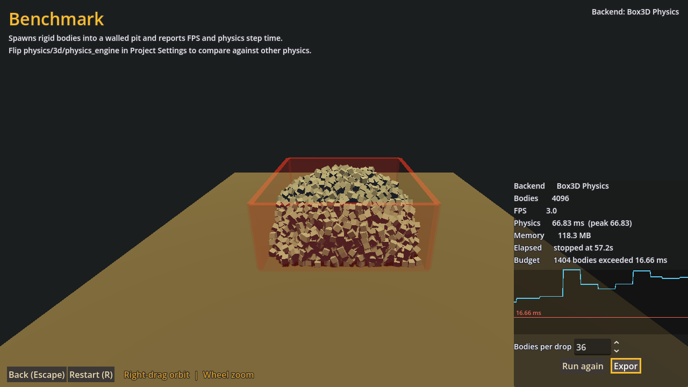
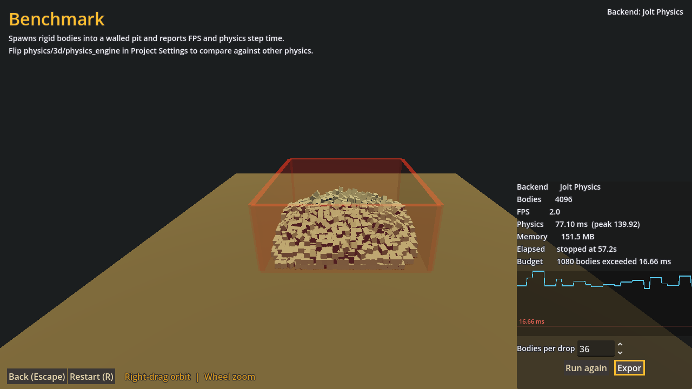
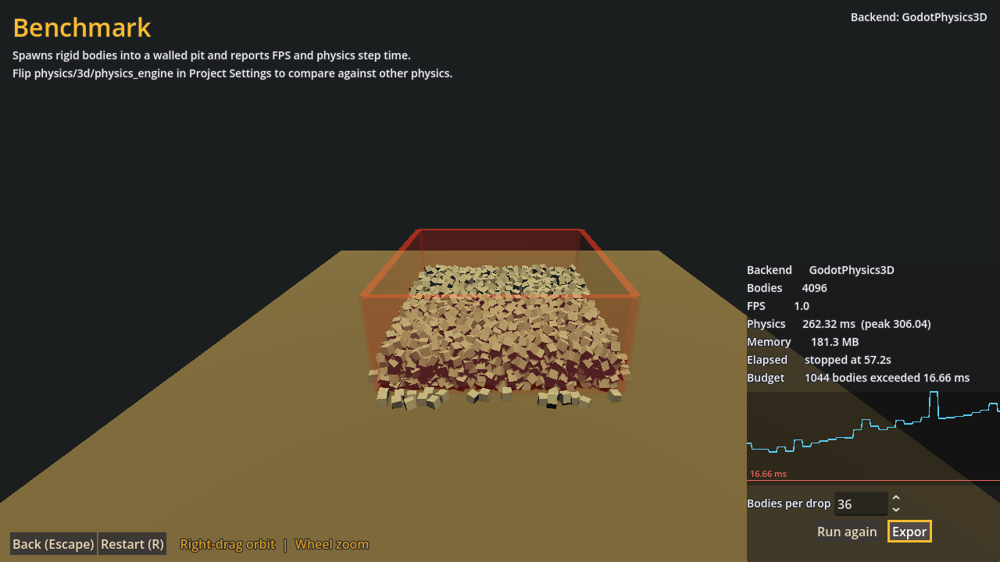
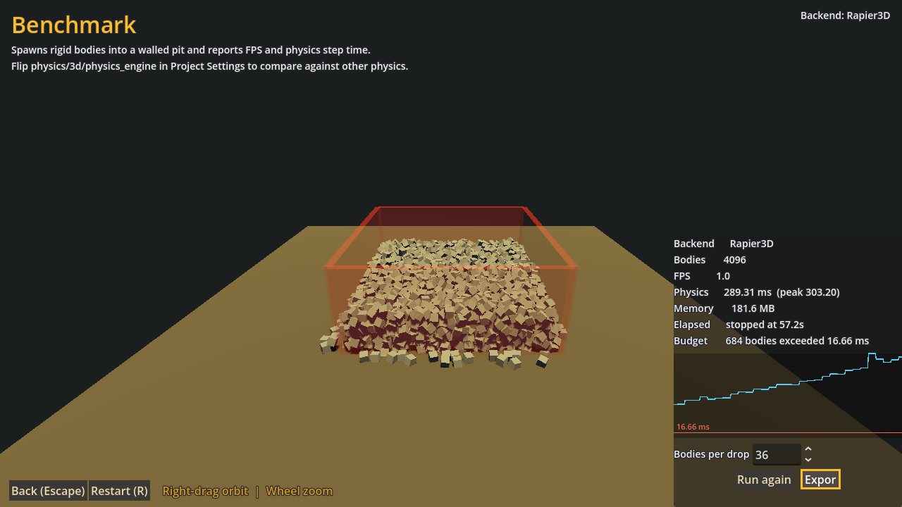

# godot-box3d

A [GDExtension](https://docs.godotengine.org/en/stable/tutorials/scripting/gdextension/what_is_gdextension.html) that integrates [Box3D](https://github.com/erincatto/box3d), Erin Catto's 3D physics engine, into Godot 4 as a drop-in replacement for the built-in `PhysicsServer3D`.

Stock Godot physics nodes keep working. You change a project setting, not your scenes.

> **Status: early and experimental.** Box3D itself is a young engine, and this extension is a work in progress. Expect missing features and rough edges.

**Documentation:** https://bearlikelion.github.io/godot-box3d/

## Why

I'm building [SurfsUp](https://store.steampowered.com/app/3454830/SurfsUp/), a recreation of Source-engine "SkillSurf" in Godot. Surf maps are hard on a physics engine: long ramps built from concave trimesh, corners taken at speed, and head surf along the underside of geometry. Godot's built-in physics and godot-jolt both have trouble with parts of that.

Box3D is worth trying here because of where it came from. [Erin Catto](https://x.com/erin_catto) started it from Valve's Rubikon-lite, the physics engine of Source 2 ([Announcing Box3D](https://box2d.org/posts/2026/06/announcing-box3d/#valve-to-the-rescue)). So I thought a Rubikon-lineage solver seemed like a reasonable bet to try.

New tech is cool and Godot is great. That's most of it. This is my first time doing physics programming, and I am building the bridge between Godot's [PhysicsServer3D](https://docs.godotengine.org/en/stable/classes/class_physicsserver3d.html) and Box3D based on the arcitecture of [godot-jolt](https://github.com/godot-jolt/godot-jolt)

## Comparison with box3d-godot

[box3d-godot](https://github.com/Stink-O/box3d-godot) is another Box3D binding for Godot. It exposes Box3D as 14 custom nodes (`Box3DWorld`, `Box3DBody`, eight joint types, a character controller) running alongside Godot's physics. This project replaces Godot's physics instead.

| | godot-box3d (this) | box3d-godot |
|---|---|---|
| Approach | Implements `PhysicsServer3D` | Custom `Box3DWorld` / `Box3DBody` nodes |
| Stock Godot nodes | Work unchanged | Not supported; scenes are rewritten |
| Adopting it | Change a project setting | Port every physics node |
| Existing addons | Keep working | Do not apply |
| Joints | 3 (pin, hinge, slider) | 8 (adds ball, fixed, motor, wheel, parallel, distance) |
| Vehicles | `VehicleBody3D` (raycast) | `Box3DWheelJoint` (real constraint) |
| Heightfields | Yes | No |
| Platforms | Linux, Windows, Web (macOS arm64, untested) | + Android, web |
| Box3D-only features | Not reachable | Explosions, gyroscopic torque, solver profiling, async stepping |

box3d-godot exposes more of Box3D. This project keeps your project working.

The trade is structural. `PhysicsServer3D` has no entry point for `b3World_Explode`, no wheel joint in its `JointType` enum, and no hook for solver profiling, so a drop-in backend can't surface them. Equally, box3d-godot's nodes are a separate type hierarchy, so `RigidBody3D`, `CharacterBody3D`, and third-party physics addons don't apply there.

Use this if you have an existing project or want stock nodes and addons to work. Use box3d-godot if you want Box3D's own feature surface and don't mind building scenes around its nodes. Neither is production-ready.

**Currently behind box3d-godot on:** *joint types, ConeTwist and 6DOF, profiling, and Android support.*

## What works

- Rigid, static, and kinematic bodies
- Shapes: box, sphere, capsule, cylinder, convex polygon, concave polygon (trimesh), heightmap, and world boundary
- Areas, including overlap events, gravity/damping overrides, priority ordering, and point gravity
- Direct space state queries: ray casts, point and shape intersection, shape casts (`cast_motion`), `collide_shape`, and `rest_info`
- `body_test_motion`, so `CharacterBody3D` and `move_and_slide()` work
- Contact monitoring, so `RigidBody3D` reports real contact points, normals, and impulses
- Queries and contact results report per-shape indices for multi-shape bodies
- Per-pair collision exceptions
- Joints: pin, hinge, and slider (pin anchors can be moved after creation)
- Multithreaded solver: the worker count auto-detects physical cores and can be overridden with the `physics/box3d/worker_count` project setting (results are deterministic across worker counts)
- A test project with a demo hub, a deterministic benchmark, and 21 headless regression tests

## What's left to do

- Separation ray shapes
- ConeTwist joints
- `Generic6DOFJoint3D` (Box3D has no per-axis lock/limit/motor constraint, so there is no faithful mapping; use `PinJoint3D`, `HingeJoint3D`, or `SliderJoint3D` instead)
- `SoftBody3D`
- Solver profiling
- macOS support: universal binaries and notarization (arm64 builds compile but are untested)
- More platforms and architectures (currently Linux, Windows, and Web)
- Performance benchmarking and tuning

## Behavior differences

- **`Area3D` does not detect trimesh or heightmap bodies.** In Box3D a concave shape (`ConcavePolygonShape3D`) or `HeightMapShape3D` can never act as a sensor *visitor*, by design, since testing an arbitrary mesh against a sensor is too expensive.
  So an `Area3D` silently ignores a body whose shape is a trimesh or heightmap: no `body_entered` / `body_exited` fires for it.
  This diverges from Godot's built-in physics (and Jolt), which report such a body on the first physics frame.
  If you need a body to be detected by an area, give it a convex shape. (A trimesh may still be used *as* an `Area3D`'s own shape to detect convex bodies passing through it.)

- **`collide_shape()` reports contact points without penetration depth.** Box3D exposes GJK, which finds the closest points between two shapes but cannot measure how far they already overlap.
  For a genuinely overlapping pair both returned points are the same witness point, so the pair's separation reads as zero, where Godot's built-in physics returns two points whose distance is the penetration depth.
  Whether shapes overlap, which bodies they are, `max_results`, and `collision_mask` all behave normally, so use it to answer "is anything here, and roughly where" rather than "how deep".

- **Shape queries need a convex query shape.** `intersect_shape`, `cast_motion`, `collide_shape`, `rest_info`, and `body_test_motion` build a point-cloud proxy of the shape being queried *with*, and trimesh, heightmap, and world-boundary shapes have no finite point cloud.
  Passing one of those as the query shape returns no results. They work normally as targets in the world.

- **Friction and restitution combine differently.** Box3D uses `sqrt(a * b)` for friction and `max(a, b)` for restitution; Godot's built-in physics uses `min(a, b)` and a clamped sum.
  Materials tuned against Godot's defaults will not feel the same, so a port usually needs its friction values revisited.

## Benchmarks

The demo project's benchmark scene drops boxes onto a fixed lattice from a fixed seed, 36 at a time every 0.5s, until 4096 bodies are in the world. Same scene, same placement, same seed on every backend, so the only variable is the physics engine.

Run on Linux, Godot 4.7.2.rc, 4096 boxes over 57s. Lower is better except for the first column. These numbers predate the multithreaded solver, so the Box3D column was measured with a single worker; with threading enabled its step time at high body counts improves by roughly 1.5x.

| Backend | Bodies at 16.66 ms | Median step | p95 step | Peak step | Memory |
|---|---|---|---|---|---|
| **Box3D Physics** | **1404** | **27.3 ms** | **63.1 ms** | **66.8 ms** | **117 MB** |
| Jolt Physics | 1080 | 56.9 ms | 99.9 ms | 139.9 ms | 150 MB |
| Godot Physics | 1044 | 54.6 ms | 235.5 ms | 306.0 ms | 177 MB |
| Rapier3D | 684 | 79.2 ms | 249.3 ms | 303.2 ms | 177 MB |

"Bodies at 16.66 ms" is how many boxes were in the world when the physics step first blew the 60 FPS budget. None of the four recover below budget afterward, so it is a stable knee rather than a one-frame spike.

Box3D held the frame budget longest and stayed the most consistent under load: its p95 is close to its peak, while Godot Physics and Rapier both spike to roughly 4x their median. That tail matters more than the median for a game, since it is what shows up as a stutter.

Two caveats. All four are past the budget well before 4096 bodies, so this measures how they degrade under overload, not a workload any of them handles comfortably. And a dense box pile is one workload: it rewards a solver tuned for stacked contacts and says nothing about raycasts, character controllers, or joints. Take it as a starting point, not a ranking.

| Box3D Physics | Jolt Physics |
|---|---|
| [](docs/images/benchmarks/box3d.png) | [](docs/images/benchmarks/jolt.png) |
| **Godot Physics** | **Rapier3D** |
| [](docs/images/benchmarks/godot-physics.png) | [](docs/images/benchmarks/rapier.png) |

Reproduce it by opening the demo project, picking a backend on the main menu, and running the benchmark scene. The export button writes a PNG and a per-frame CSV to `user://`.

## Requirements

- Godot 4.3 or newer. CI runs the physics suite on both 4.3 and the current test target, 4.7.

## Installation

Download the addon zip from [Releases](https://github.com/bearlikelion/godot-box3d/releases) and copy `addons/godot-box3d/` into your project:

```
your-project/
  addons/godot-box3d/
    godot-box3d.gdextension
    bin/
      libgodot-box3d.so      (Linux)
      godot-box3d.dll        (Windows)
      libgodot-box3d.dylib   (macOS)
```

Then set **Project Settings → Physics → 3D → Physics Engine** to `Box3D Physics` and restart. The physics server is built once at startup, so the change needs a restart.

The solver is multithreaded. By default it uses one worker per physical core (efficiency cores and hyperthreads are excluded, since they slow the solver's synchronised stages down). To override it, set `physics/box3d/worker_count` (visible with Advanced Settings on) to an explicit count; `0` means auto. This also needs a restart, and simulation results are identical at any worker count. The supported no-thread Web profile always uses one worker.

> **macOS is a work in progress.** Builds are Apple Silicon (arm64) only and are not notarized, so Intel Macs cannot load the library and Gatekeeper will need convincing on any Mac. Linux and Windows are the tested platforms. macOS is untested beyond compiling, so treat it as unsupported for now.

## Building

```sh
cmake -B build
cmake --build build
```

For Web, the quickest supported route builds the extension, matching dynamic-link export templates, and a ready-to-copy bundle:

```sh
MAX_JOBS=4 scripts/quickstart_web.sh
```

The result is `dist/godot-box3d-web-release.zip`. See [WEB_QUICKSTART.md](WEB_QUICKSTART.md) for project settings and the Chromium smoke command.

The library lands in `bin/` and is copied into `test_project/addons/godot-box3d/bin/`, so the test project always runs against a fresh build.

Cross-compiling a Windows DLL from Linux with MinGW-w64:

```sh
cmake -B build-win --toolchain "$(pwd)/cmake/mingw-w64.cmake" -G Ninja
cmake --build build-win --parallel
```

## Testing

```sh
GODOT_BIN=/path/to/godot scripts/run_headless_tests.sh
```

The runner builds the extension, registers it, checks the Box3D backend actually loaded, then runs 21 headless regression tests. It exits nonzero if a test fails or leaks a Box3D RID. `GODOT_BIN` can be omitted when a suitable `godot` is on `PATH`.

CI executes that suite with Godot 4.7 on Linux, Windows, and macOS, and separately on the minimum supported Godot 4.3. It also runs the suite against a Debug build instrumented with AddressSanitizer and UndefinedBehaviorSanitizer.

## Contributing

Help wanted! This is a big project for one person, and contributions of any size are welcome: missing features from the list above, bug reports with reproduction scenes, benchmarks, documentation, or just trying it in your project and reporting what breaks. Open an issue or a pull request.

## License

MIT. See [LICENSE](LICENSE) for details.

Box3D is licensed under the [MIT license](https://github.com/erincatto/box3d/blob/main/LICENSE). This project takes structural inspiration from [godot-jolt](https://github.com/godot-jolt/godot-jolt), also MIT licensed.
